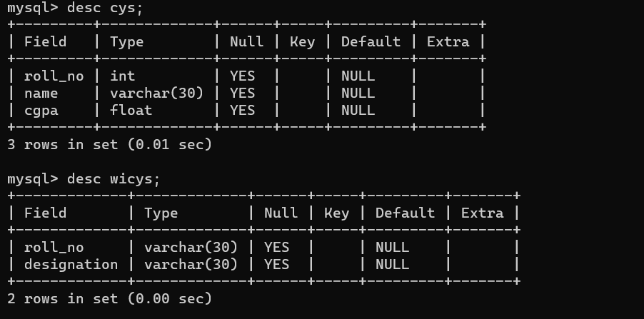
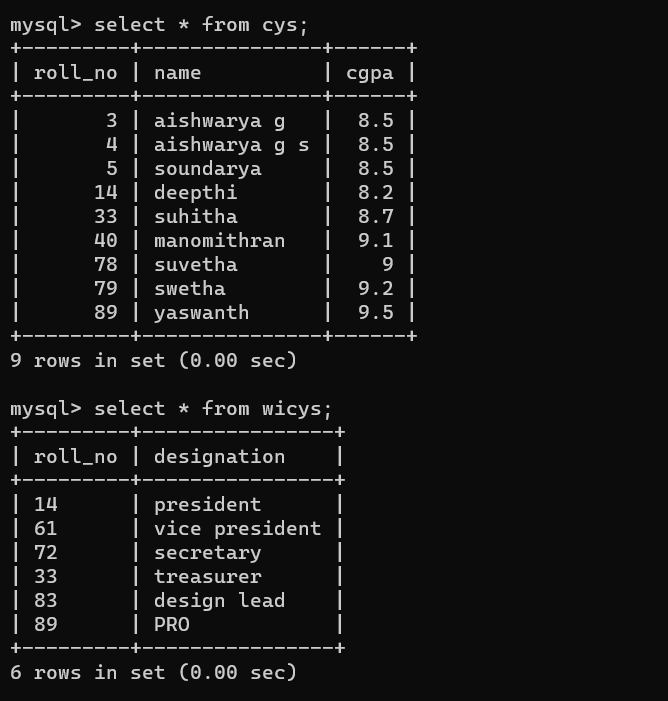
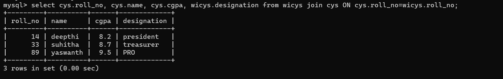
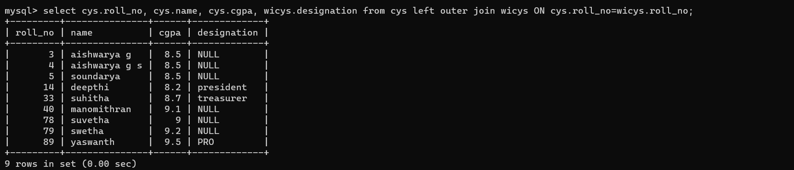
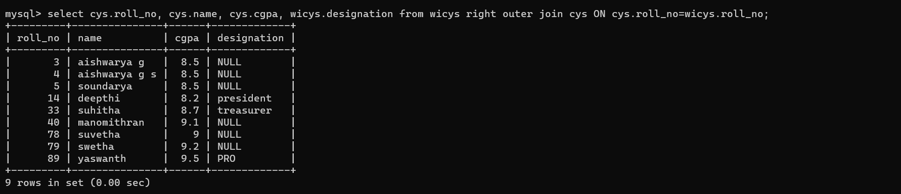
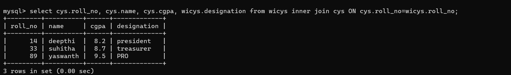
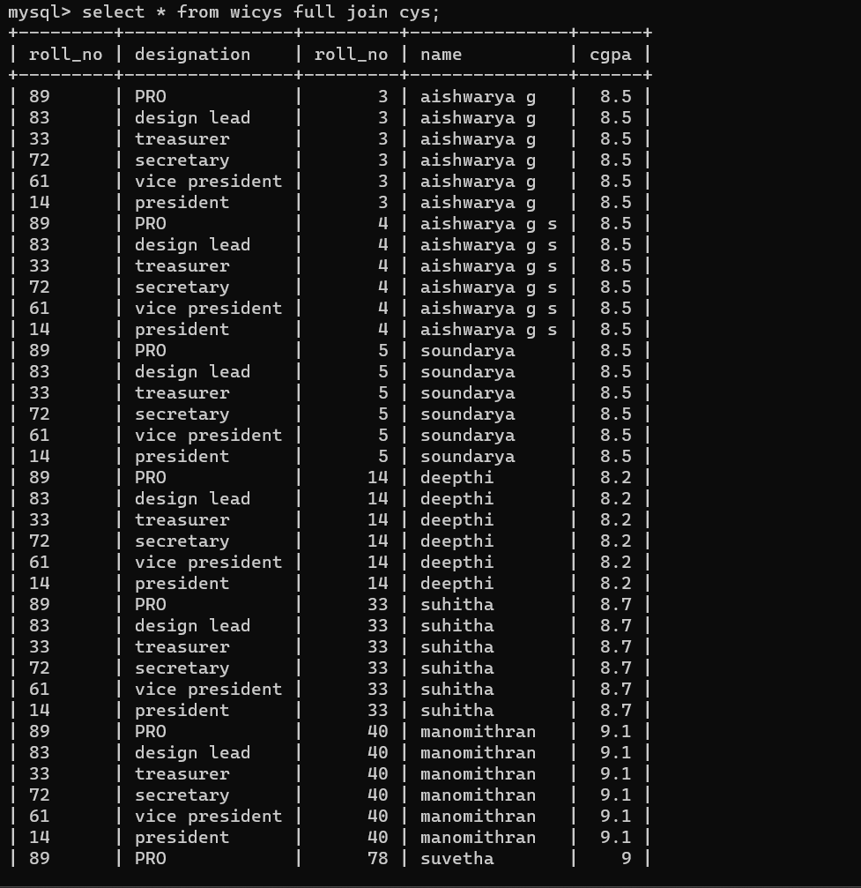

# DBMS Examples

## Joins

#### Table Description

    

#### Table Values

    

#### Join

    

#### Left Outer Join

    

#### Right Outer Join

    

#### Inner Join

    

#### Full Join

    

